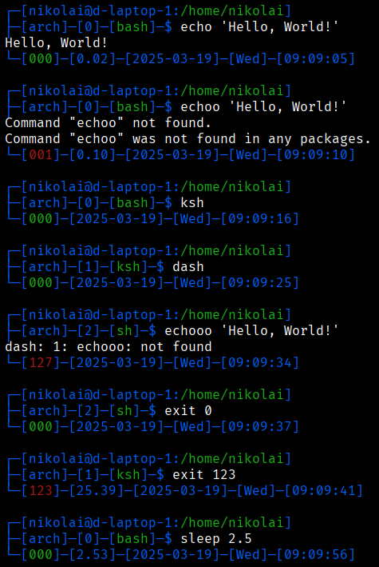
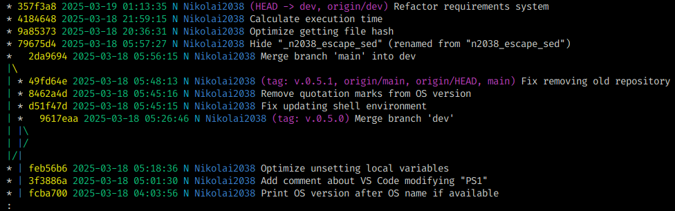

# my-shell-environment

## 1. Description

My personal shell environment customizations, which is both useful and simple to install.

## 2. Preview



Structure of the command prompt:

```plaintext
┌─[USER_NAME@PC_NAME:FULL_PATH_TO_THE_CURRENT_DIRECTORY]
├─[OS_NAME]─[SHELL_DEPTH]─[SHELL_NAME]─$ COMMAND
COMMAND_OUTPUT
└─[COMMAND_RETURN_CODE]─[EXECUTION_TIME_IN_SECONDS]─[FINISHED_DATE]─[FINISHED_DAY_OF_THE_WEEK]─[FINISHED_TIME]
```

## 3. Supported shells

- `sh` (tested with start from `bash`);
- `bash`;
- `bash` (MINGW on Windows);
- `dash` (tested with start from `bash`);
- `ksh` (tested with start from `bash`).

## 4. Installation

### 4.1. Stable version

#### 4.1.1. Debian

```sh
sudo apt-get update && sudo apt-get install -y grep git debianutils ncurses-bin psmisc && \
rm -rf ~/.my-shell-environment; git clone --branch main https://github.com/Nikolai2038/my-shell-environment.git ~/.my-shell-environment && . ~/.my-shell-environment/n2038_my_shell_environment.sh && n2038_my_shell_environment install; rm -rf ~/.my-shell-environment
```

#### 4.1.2. Arch Linux

```sh
sudo pacman --sync --refresh --needed --noconfirm which grep git ncurses psmisc && \
rm -rf ~/.my-shell-environment; git clone --branch main https://github.com/Nikolai2038/my-shell-environment.git ~/.my-shell-environment && . ~/.my-shell-environment/n2038_my_shell_environment.sh && n2038_my_shell_environment install; rm -rf ~/.my-shell-environment
```

#### 4.1.3. Termux

```sh
pkg update && pkg install -y which grep git ncurses-utils psmisc && \
rm -rf ~/.my-shell-environment; git clone --branch main https://github.com/Nikolai2038/my-shell-environment.git ~/.my-shell-environment && . ~/.my-shell-environment/n2038_my_shell_environment.sh && n2038_my_shell_environment install; rm -rf ~/.my-shell-environment
```

#### 4.1.4. Fedora

```sh
sudo dnf install -y which grep git ncurses psmisc && \
rm -rf ~/.my-shell-environment; git clone --branch main https://github.com/Nikolai2038/my-shell-environment.git ~/.my-shell-environment && . ~/.my-shell-environment/n2038_my_shell_environment.sh && n2038_my_shell_environment install; rm -rf ~/.my-shell-environment
```

#### 4.1.5. Windows

1. Install [Git](https://git-scm.com/downloads/win);
2. Then run in Bash (MINGW):

    ```sh
    rm -rf ~/.my-shell-environment; git clone --branch main https://github.com/Nikolai2038/my-shell-environment.git ~/.my-shell-environment && . ~/.my-shell-environment/n2038_my_shell_environment.sh && n2038_my_shell_environment install; rm -rf ~/.my-shell-environment
    ```

### 4.2. Development version

#### 4.2.1. Debian

```sh
sudo apt-get update && sudo apt-get install -y grep git debianutils ncurses-bin psmisc && \
rm -rf ~/.my-shell-environment; git clone --branch dev https://github.com/Nikolai2038/my-shell-environment.git ~/.my-shell-environment && . ~/.my-shell-environment/n2038_my_shell_environment.sh && n2038_my_shell_environment --dev install; rm -rf ~/.my-shell-environment
```

#### 4.2.2. Arch Linux

```sh
sudo pacman --sync --refresh --needed --noconfirm which grep git ncurses psmisc && \
rm -rf ~/.my-shell-environment; git clone --branch dev https://github.com/Nikolai2038/my-shell-environment.git ~/.my-shell-environment && . ~/.my-shell-environment/n2038_my_shell_environment.sh && n2038_my_shell_environment --dev install; rm -rf ~/.my-shell-environment
```

#### 4.2.3. Termux

```sh
pkg update && pkg install -y which grep git ncurses-utils psmisc && \
rm -rf ~/.my-shell-environment; git clone --branch dev https://github.com/Nikolai2038/my-shell-environment.git ~/.my-shell-environment && . ~/.my-shell-environment/n2038_my_shell_environment.sh && n2038_my_shell_environment --dev install; rm -rf ~/.my-shell-environment
```

#### 4.2.4. Fedora

```sh
sudo dnf install -y which grep git ncurses psmisc && \
rm -rf ~/.my-shell-environment; git clone --branch dev https://github.com/Nikolai2038/my-shell-environment.git ~/.my-shell-environment && . ~/.my-shell-environment/n2038_my_shell_environment.sh && n2038_my_shell_environment --dev install; rm -rf ~/.my-shell-environment
```

#### 4.2.5. Windows

1. Install [Git](https://git-scm.com/downloads/win);
2. Then run in Bash (MINGW):

    ```sh
    rm -rf ~/.my-shell-environment; git clone --branch dev https://github.com/Nikolai2038/my-shell-environment.git ~/.my-shell-environment && . ~/.my-shell-environment/n2038_my_shell_environment.sh && n2038_my_shell_environment --dev install; rm -rf ~/.my-shell-environment
    ```

### 4.4. More about commands

Required commands:

- `which`, `sed`, `grep`, `git`, `tput`, `sha256sum`.

Optional commands:

- `pstree`: Will allow to output current shell depth.

    NOTE: If you install `psmisc` in already applied "my-shell-environment", for shell depth to appear you need to do either of one:

    - Open a **new terminal** (even **not a new shell**, because shell depth is recalculating based on the process tree);
    - Or just execute (but this method will see current shell as level `0`, regardless of the parent shells number):

        ```sh
        _N2038_INIT_SHELL_DEPTH="" && n2038_my_bash_environment activate
        ```

## 5. Uninstallation

```sh
sed -Ei '/(my-shell-environment|my_shell_environment)/d' "${HOME}/.bashrc" && \
sudo rm -rf "${_N2038_SHELL_ENVIRONMENT_PATH}"
```

Then reopen the terminal.

## 6. Update

```bash
n2038_my_shell_environment update
```

## 7. Settings

You can set some environment variables to change "my-shell-environment" behaviour:

- `N2038_PROGRAMS_PATH`: Path to directory, in which some programs (for example, JetBrains products) will be installed;
- `N2038_DOWNLOADS_PATH`: Path to directory, in which files will be downloaded when needed by "my-shell-environment".

## 8. Features

### 8.1. Command prompt

As shown in preview above, these scripts when sourced will show information about:

- Current user;
- Hostname;
- Full path to the current directory;
- Current real shell (follows symlinks);
- Exit code of the finished command. If it is not `0`, it will be red (can be seen on preview);
- Execution time in seconds (only in `bash`);
- Date and time when command was finished.

### 8.2. Aliases

Aliases are stored as functions in files inside `./scripts/aliases` directory - you can see their implementation there.

Some aliases have logic with provided arguments, but all of them are accepting any extra arguments after.

The equals (for example, `l` = `ls`) descriptions below are just informative - actual aliases have more complex logic than that.

#### 8.2.1. `ls`

- `l` = `ls`: Prints list of the files (exclude hidden);
- `la` = `ls -a`: Prints list of the files (include hidden);
- `ll` = `ls -l`: Prints list of the files (exclude hidden) with their details;
- `lla` = `ls -la`: Prints list of the files (include hidden) with their details;
- `lm`: Prints list of the files (exclude hidden) in Markdown format;
- `lam` or `lma`: Prints list of the files (include hidden) in Markdown format.

#### 8.2.2. `git`

- `gs` = `git status`: Show Git repository status;
- `ga [arg, default: .]` = `git add`: Add files to Git index. If no files specified, adds all files (`.`);
- `gc <message>` = `git commit -m`: Commit changes with message;
- `gpull` = `git pull`: Pull changes from remote repository;
- `gpush` = `git push`: Push commits to remote repository;
- `gp` = `git pull && git push`: Pull and then push changes to the remote repository;
- `gl` = `git log`: Show beautified Git log. Shows a colorized log with commit hash, date, GPG signature, author, branches/tags, and commit message:

    

#### 8.2.3. `docker`

Main:

- `dps` = `docker ps`: Prints list of the running containers;
- `dpi` = `docker images`: Prints colorful list of the images with line format:

    ```plaintext
    <image>:<tag> (<size>)
    ```

Extra:

- `dpsq` = `docker ps -q`: Prints list of hashes of the running containers;
- `dpsa` = `docker ps -a`: Prints list of all containers (running and stopped);
- `dpsaq` = `docker ps -aq`: Prints list of hashes of all containers (running and stopped).

#### 8.2.4. `docker-compose`

Main:

- `dc` = `docker-compose`;
- `dcu` = `docker-compose up --detach --wait`;
- `dcb` = `docker-compose build`;
- `dcd` = `docker-compose down`;
- `dcr` = `docker-compose restart`;
- `dcl` = `docker-compose logs`;
- `dcps` = `docker-compose ps`;

Extra:

- `dcud` = `docker-compose up --detach --wait && docker-compose down`;
- `dcbu` = `docker-compose build && docker-compose up --detach --wait`;
- `dcbud` = `docker-compose build && docker-compose up --detach --wait && docker-compose down`;
- `dcbdu` = `docker-compose build && docker-compose down && docker-compose up --detach --wait`;
- `dcdb` = `docker-compose down && docker-compose build`;
- `dcdu` = `docker-compose down && docker-compose up --detach --wait`;
- `dcdbu` = `docker-compose down && docker-compose build && docker-compose up --detach --wait`;
- `dcpsa` = `docker-compose ps -a`;
- `dcpsq` = `docker-compose ps -q`;
- `dcpsaq` = `docker-compose ps -aq`.

### 8.3. Scripts

#### 8.3.1. JetBrains

#### 8.3.1.1. `n2038_jetbrains_install.sh` - Install specified JetBrains product (latest stable) for current OS

Usage:

```sh
n2038_jetbrains_install.sh <product_name>
```

Where:

- `product_name` can be one of the: `idea`, `phpstorm`, `clion`, `pycharm`, `webstorm`, `rider`, `rubymine`, `rustrover`, `writerside`, `datagrip`, `dataspell`, `fleet`, `goland`.

#### 8.3.1.2. `n2038_jetbrains_download.sh` - Download specified JetBrains product (latest stable installer) in the downloads directory

Usage:

```sh
n2038_jetbrains_download.sh <product_name> <download_type>
```

Where:

- `product_name` can be one of the: `idea`, `phpstorm`, `clion`, `pycharm`, `webstorm`, `rider`, `rubymine`, `rustrover`, `writerside`, `datagrip`, `dataspell`, `fleet`, `goland`;
- `download_type` can be on of the: `linuxARM64`, `linux`, `windows`, `thirdPartyLibrariesJson`, `windowsZip`, `windowsARM64`, `mac`, `macM1`.

#### 8.3.1.3. `n2038_jetbrains_clear_all_data.sh` - Clear all data of the JetBrains products (reset all settings, logins, etc.)

Usage:

```sh
n2038_jetbrains_clear_all_data.sh
```

#### 8.3.2. `n2038_firefox_search_engines_export.sh` and `n2038_firefox_search_engines_import.sh` - Export and import Firefox's search engines

Since Firefox does not sync search engines (and even more - it does not allow editing them), I wrote these scripts to export and import them. Usage:

```sh
n2038_firefox_search_engines_export.sh [--dev] <file_path>
```

Where:

- `--dev`: If to use Firefox for Developers instead of default Firefox;
- `--mozlz4`: If to export in "mozlz4" format, not JSON. In this case command "mozlz4" not needed to be installed (useful on Windows);
- `file_path`: Path to the file where search engines data will be saved. Format is JSON.

And:

```sh
n2038_firefox_search_engines_import.sh [--dev] <file_path>
```

Where:

- `--dev`: If to use Firefox for Developers instead of default Firefox;
- `--mozlz4`: If provided file is in "mozlz4" format, not JSON. In this case command "mozlz4" not needed to be installed (useful on Windows);
- `file_path`: Path to the file from where search engines data will be loaded.

Example 1:

```sh
# Save search engines from Firefox for Developers into file
n2038_firefox_search_engines_export.sh --dev search.json

# Load search engines for default Firefox from file
n2038_firefox_search_engines_import.sh search.json

# Remove temp file
rm search.json
```

Example 2 (we assume, that `my-shell-environment` is already installed on both machines):

1. On the Linux Machine:

    ```sh
    # Save search engines from Firefox for Developers into file without extracting "mozlz4"
    n2038_firefox_search_engines_export.sh --dev --mozlz4 search.json.mozlz4
    ```

2. Move file `search.json.mozlz4` to the Windows machine;
3. On the Windows machine:

    ```sh
    # Load search engines for default Firefox from file without extracting "mozlz4"
    n2038_firefox_search_engines_import.sh --mozlz4 search.json.mozlz4

    # Remove temp file
    rm search.json.mozlz4
    ```

#### 8.3.3. `n2038_check_port.sh` - Check if port is open on the specified host

Usage:

```sh
n2038_check_port.sh <host>:<port> [<proxy_host>:<proxy_port>]
```

Where:

- `host`: Host to connect;
- `port`: Port to connect;
- `proxy_host`: Host of the proxy to use before checking connection;
- `proxy_port`: Port of the proxy to use before checking connection.

For usage with proxy command `proxytunnel` must be installed.

## 9. More information

### 9.1. About `n2038` prefix

`n2038` prefix was chosen from my nickname to use something unique - to not be confused with system scripts. All functions except aliases have it.

### 9.2. Environment variables (to customize environment)

These constants can be overridden via environment variables:

- `N2038_IS_DEBUG`: If debug mode is enabled (more logs will be shown);
- (must be overridden before installation) `_N2038_SHELL_ENVIRONMENT_NAME`: Name for the scripts folder and name to be shown in logs;
- (must be overridden before installation)`_N2038_SHELL_ENVIRONMENT_REPOSITORY_URL`: Repository URL to install scripts from;

### 9.3. Code style

#### 9.3.1. Naming

- I use `n2038_` prefix for all variables and functions to not be confused with other ones in the system;
- I use `_` prefix for variables, which are not intended to be changed by the user;
- I use `_` prefix for functions, which are not intended to be executed by the user (but by the developer - can and must be interactive and informative about it);
- I use `__` prefix for local variables, constants and functions, which will not be available outside function;
    - Special function `_n2038_unset` is used to unset all local variables and constants - so use them in one function only. If you want to temporarily export some variable to be used in another function - consider it as constant and prefix it with `_`. Unset it by hand when not needed anymore (for example, `_N2038_RETURN_CODE_PS1` and `_N2038_PWD_BEFORE_IMPORTS_*` are like that);
- I try to use `sh` syntax on main elements of the shell environment. In the future, I will add several customizations for `bash` and probably some other shells when I will get to them.

#### 9.3.2. Syntax

- Each shell script contains function with same name. Exceptions: constants and aliases (see below for more info about them). All code done in function and `return`'s are used. We pass all the arguments to this function and check them all in it. After function call, return code is checked. If it is not `0`, we `exit` or `return` from the script based on if it was executed or sourced (see `_n2038_return` for more context).

#### 9.3.3. Returns and exits

- Each command, which can return non-zero return code, must end with `|| return "$?"`, `|| exit "$?"` or `|| true`;
- `exit` is forbidden to be used inside functions - only `return`. This is because we can source shell script and execute function directly in the shell - so calling `exit` from it will result in shell exit (terminal close or disconnection from the remote);
- Instead of `some_function || return "$?"` use `some_function || { _n2038_unset "$?" && return "$?" || return "$?"; }`:
- Before `return 0` use `unset` to unset all local variables;
- Instead of (for example) `return "${_N2038_RETURN_CODE_WHEN_ERROR_WITH_MESSAGE}"` use `_n2038_unset "${_N2038_RETURN_CODE_WHEN_ERROR_WITH_MESSAGE}" && return "$?" || return "$?"`.

#### 9.3.4. Constants

- Constants are stored in `_constants.sh` files (can be several) and usually does not have main function at all;
- I use UPPERCASE names for constants. For example, `N2038_IS_DEBUG`.

#### 9.3.5. Aliases

- Aliases are stored as group of functions in `./scripts/aliases` folder;
- I prefer functions over aliases because they:

    - Provide more ways to play with arguments;
    - Easily maintained for large aliases (syntax highlight, references to other functions, space for comments).

#### 9.3.6. Other

- When printing colored messages with highlights, make sure to surround highlights with quotation marks too. This way they will be more readable in logs and notes;
- Use `curl --fail -L -o` instead of `wget -O`, because `wget` is not available in MINGW by default, but `curl` is.

## 9. Contribution

Feel free to contribute via [pull requests](https://github.com/Nikolai2038/my-shell-environment/pulls) or [issues](https://github.com/Nikolai2038/my-shell-environment/issues)!
