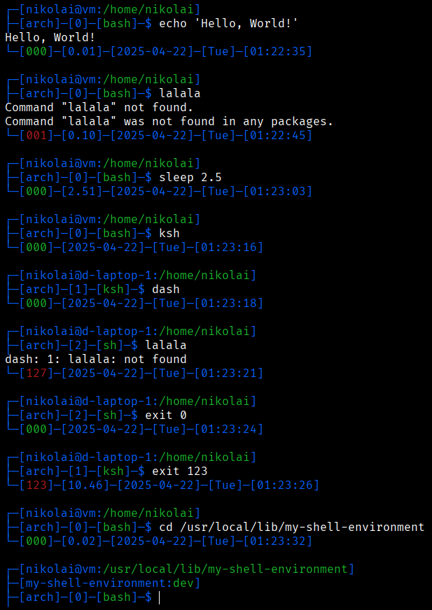

# my-shell-environment

## 1. Description

My personal shell environment customizations, which is both useful and simple to install.

## 2. Preview



## 3. Requirements

Supported shells (tested with start from `bash`):

- `sh`;
- `bash`;
- `dash`;
- `ksh`.

Required commands:

- `git`, `grep`, `which`, `tput`.

You can install them via:

- Termux:

    ```sh
    pkg update && pkg install -y git grep which ncurses-utils
    ```

- Arch Linux:

    ```sh
    sudo pacman --sync --refresh --needed --noconfirm git grep
    ```

## 4. Installation

Stable version:

```sh
rm -rf ~/.my-shell-environment; git clone --branch main https://github.com/Nikolai2038/my-shell-environment.git ~/.my-shell-environment && . ~/.my-shell-environment/n2038_my_shell_environment.sh && n2038_my_shell_environment install && n2038_my_shell_environment activate; rm -rf ~/.my-shell-environment
```

Development version:

```sh
rm -rf ~/.my-shell-environment; git clone --branch dev https://github.com/Nikolai2038/my-shell-environment.git ~/.my-shell-environment && . ~/.my-shell-environment/n2038_my_shell_environment.sh && n2038_my_shell_environment --dev install && n2038_my_shell_environment activate; rm -rf ~/.my-shell-environment
```

## 5. Update

```bash
n2038_my_shell_environment update
```

## 6. Features

- Shows information about:

    - Current user;
    - Hostname;
    - Full path to the current directory;
    - Current real shell (follows symlinks);
    - Exit code of the finished command. If it is not `0`, it will be red (can be seen on preview);
    - Date and time when command was finished.

- Supports any shell, because scripts are based on POSIX `sh`. Right now I checked it for `bash` and `dash`.

## 7. More information

### 7.1. About `n2038` prefix

`n2038` prefix was chosen from my nickname to use something unique - to not be confused with system scripts;

### 7.2. Environment variables (to customize environment)

These constants can be overridden via environment variables:

- `N2038_IS_DEBUG_BASH`: If debug mode is enabled (more logs will be shown);
- (must be overridden before installation) `_N2038_SHELL_ENVIRONMENT_NAME`: Name for the scripts folder and name to be shown in logs;
- (must be overridden before installation)`_N2038_SHELL_ENVIRONMENT_REPOSITORY_URL`: Repository URL to install scripts from;

### 7.3. Code style

- I use `n2038_` prefix for all variables and functions to not be confused with other ones in the system;
- I use `_` prefix for variables, which are not intended to be changed by the user;
- I use `_` prefix for functions, which are not intended to be executed by the user (but by the developer - can and must be interactive and informative about it);
- I use `__` prefix for local variables and functions, which will not be available outside function;
- I use UPPERCASE names for constants. For example, `N2038_IS_DEBUG_BASH`;
- I try to use `sh` syntax on main elements of the shell environment. In the future, I will add several customizations for `bash` and probably some other shells when I will get to them;
- Each shell script contains function with same name. All code done in function and `return` are used. We pass all the arguments to this function and check them all in it. After function call, return code is checked. If it is not `0`, we `exit` or `return` from the script based on if it was executed or sourced (see the bottom lines of any script for more context);
- Each command, which can return non-zero return code, must end with `|| return "$?"`, `|| exit "$?"` or `|| true`;
- `exit` is forbidden to be used inside functions - only `return`. This is because we can source shell script and execute function directly in the shell - so calling `exit` from it will result in shell exit (terminal close or disconnection from the remote).

## 6. Contribution

Feel free to contribute via [pull requests](https://github.com/Nikolai2038/my-shell-environment/pulls) or [issues](https://github.com/Nikolai2038/my-shell-environment/issues)!
